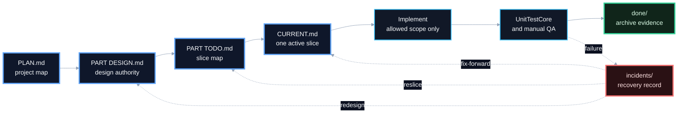
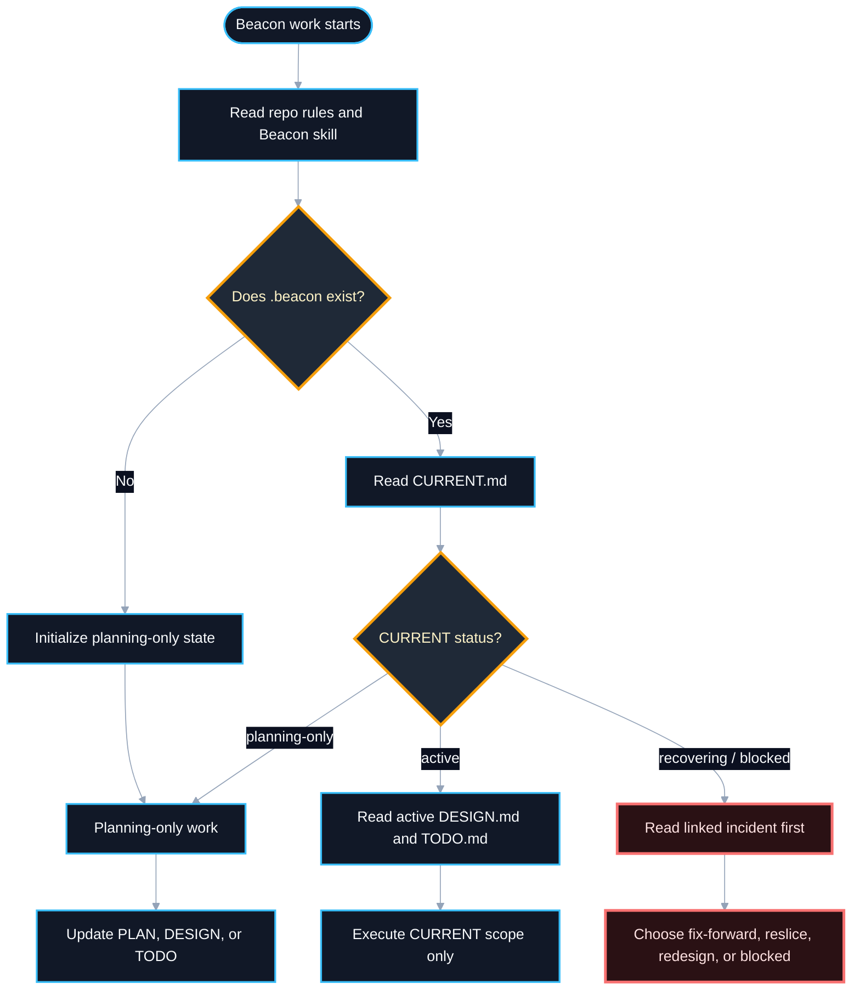
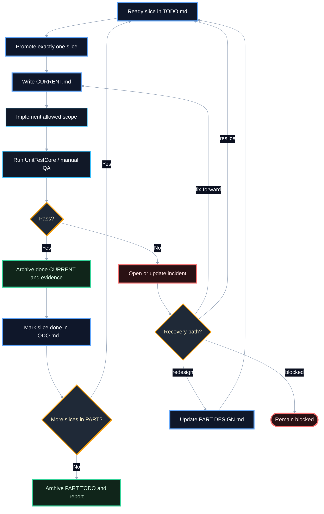
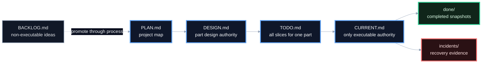

# Beacon Dev Workflow Flow

## Purpose

This document explains the Beacon development workflow as a Mermaid flowchart.
It is meant for humans reading the repository, not as executable Beacon state.

Mermaid is useful here because Beacon is a process with strict state transitions:
planning artifacts authorize design, design authorizes slices, exactly one slice
becomes executable through `CURRENT.md`, and failed work must move through an
incident before it continues.

## How To Read These Diagrams

Beacon is easier to read as a few small diagrams instead of one large workflow
map. The full process has four concerns:

- lifecycle: the happy path from plan to archive;
- routing: what the agent reads first when work starts or resumes;
- slice loop: what happens to one active slice;
- artifact authority: which file is allowed to decide what.

## Lifecycle Overview



## Resume Routing



## Single Slice Loop



## Artifact Authority



## What The Diagrams Communicate

- `BACKLOG.md` is not execution permission. Work must be promoted through PLAN,
  DESIGN, TODO, and CURRENT.
- `CURRENT.md` is the only active executable authority.
- Only one slice may be active in one `.beacon/` state.
- Verification is part of the workflow, not an optional ending.
- Failed or unsafe work moves through `incidents/` before execution continues.
- Archive files keep completed evidence out of active planning files.

## Current Skill Representation

The current Beacon skill already contains a textual flow:

- `SKILL.md` has Read Order, Workflow, State Rules, Hard Stops, and Verification.
- `references/beacon-artifacts.md` describes artifact responsibilities.
- `references/slice-contract.md` describes slice sizing and promotion.
- `references/recovery-protocol.md` describes incident and recovery flow.
- `references/verification.md` describes UnitTestCore and manual QA reporting.

The skill package contains the agent-facing workflow structure reference at
`skills/dev/beacon-dev-workflow/references/workflow-structure.md`.
`SKILL.md` still keeps the compact textual workflow:
`Plan -> Design -> Slice -> Promote -> Execute -> Verify -> Recover -> Archive`.

## Expected Internal Skill Guideline

The internal development-flow structure guideline should stay in a reference
file instead of expanding `SKILL.md`:

```txt
skills/dev/beacon-dev-workflow/
  SKILL.md
  references/
    workflow-structure.md
```

`workflow-structure.md` should contain:

- the canonical flowchart;
- the rule that `CURRENT.md` is the only executable authority;
- the rule that multi-agent work should use separate worktrees or branches, not
  multiple active slices in one `.beacon/`;
- the required transition gates between PLAN, DESIGN, TODO, CURRENT,
  UnitTestCore, incidents, and done archives.

Keep `SKILL.md` as the short invocation and routing layer. Keep detailed flow
structure in the reference so the skill remains compact.
