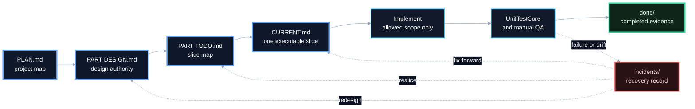
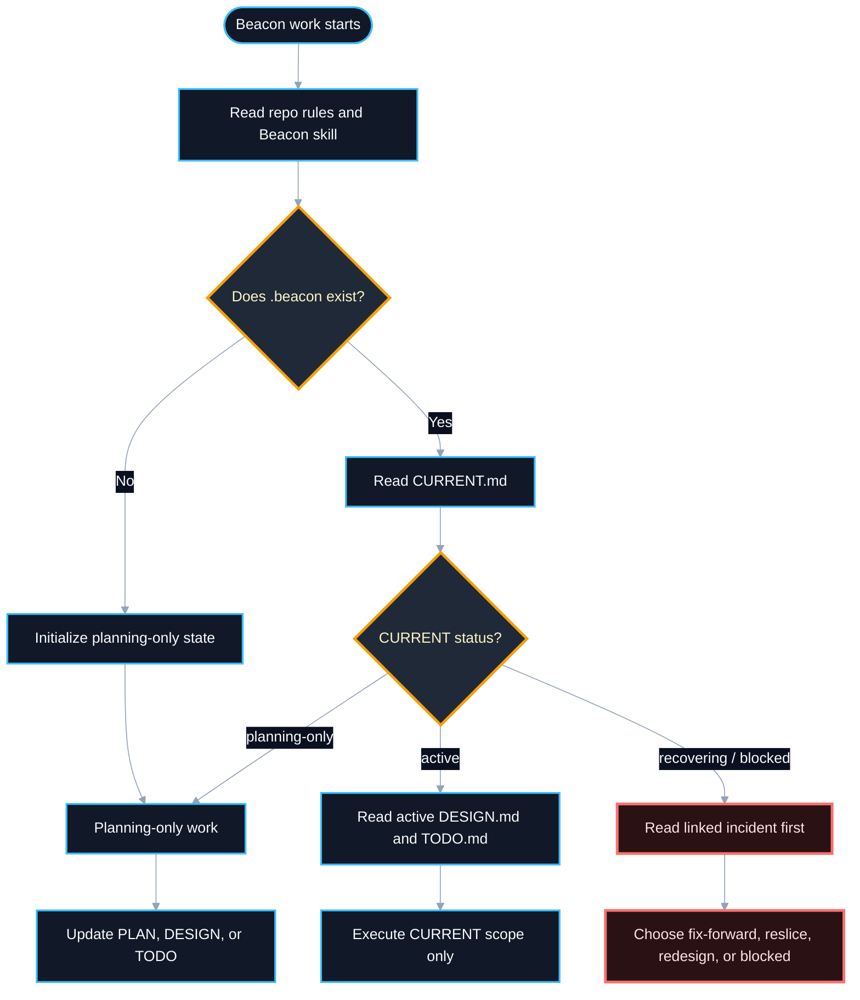
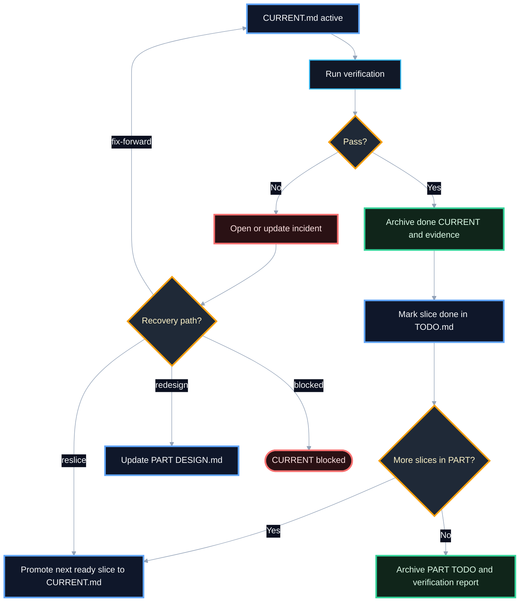

# Workflow Structure

Use this reference when the agent needs the Beacon process shape: how work
moves from project plan to one executable slice, how completed work is handed to
the next slice, and which artifact is allowed to authorize execution.

## Core Shape

## Resume Routing

## Single Slice Closure

## Agent Rules

- `CURRENT.md` is the only executable authority.
- `PLAN.md`, `DESIGN.md`, `TODO.md`, and `BACKLOG.md` can prepare work but do
  not authorize implementation by themselves.
- Missing Beacon artifacts are not user questions by default. First repair the
  state to planning-only or to the nearest non-executable artifact state. Ask
  only when the missing content requires product or design intent that cannot be
  inferred.
- Cross-slice handoff does not require `HANDOFF.md` in V1. Use `TODO.md` status,
  archived `done/` evidence, and the next `CURRENT.md`.
- Keep active files short. Put history, command output, and completion evidence
  in `done/` or `incidents/`.
- When a PART is done, keep `parts/part-XXX/TODO.md` as a compact final index
  and archive the full completed TODO snapshot under `done/part-XXX/`.
- Multi-agent work should use separate worktrees or branches. Do not represent
  multiple active slices in one `.beacon/CURRENT.md`.
