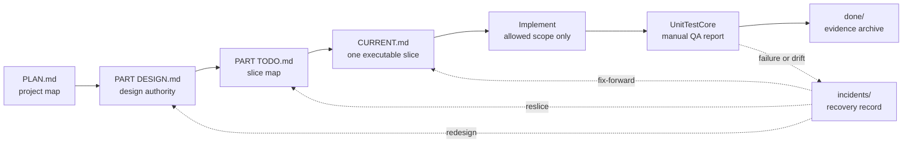

# Workflow Structure

Use this reference when the agent needs the Beacon process shape. It is the
runtime rule card, not the pretty architecture document.

## Core Flow

## Resume Rules

- Missing `.beacon/`: initialize planning-only state before coding.
- `CURRENT.md` status `planning-only`: update only PLAN, DESIGN, or TODO.
- `CURRENT.md` status `active`: read active DESIGN and TODO, then execute only
  CURRENT scope.
- `CURRENT.md` status `recovering` or `blocked`: read the linked incident first.
- Missing content is a user question only when product or design intent cannot
  be inferred.

## Closure Rules

- Finish a slice by verifying, archiving completed CURRENT plus evidence,
  marking the TODO slice done, then promoting the next ready slice if one exists.
- Finish a PART by keeping `parts/part-XXX/TODO.md` as a compact final index and
  archiving the full completed TODO snapshot under `done/part-XXX/`.
- Cross-slice handoff does not need `HANDOFF.md` in V1. Use TODO status, done
  evidence, and the next CURRENT.
- Multi-agent work uses separate worktrees or branches. Do not represent
  multiple active slices in one `.beacon/CURRENT.md`.
